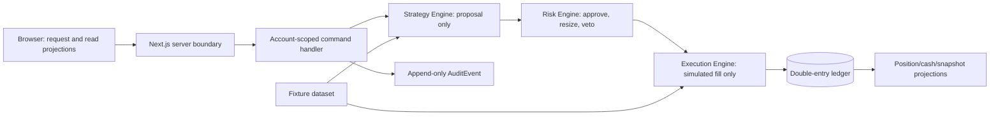

# Architecture

Milestone 1 financial behavior is locked in [Financial Policies](FINANCIAL_POLICIES.md). Architectural modules must consume those versioned policies rather than duplicate constants or rounding logic.

## 1. Decision: account-scoped modular monolith

The MVP is a Next.js App Router/TypeScript modular monolith with PostgreSQL and proposed Supabase Auth/Postgres. A `FinancialAccount` is the ownership and monetary consistency boundary, not a global singleton or a user ID sprinkled across unrelated tables. This permits multiple users and multiple accounts without adding organisations or teams.



The authoritative path is strictly `Strategy → Risk → Execution → Ledger`. Strategy code is pure and proposes intent; it cannot import repositories that mutate money. Risk may veto/resize and is persisted before execution. Execution accepts only a validated risk-approved order and posts its trade settlement and journal atomically. Projections, analytics, and dashboards are rebuildable consumers, never authorities.

M5 evidence authority follows the same server-only, append-only principle. A `CONFIGURED` manifest-authority revision selects the exact raw evidence IDs/fingerprints, compatibility configuration, and dataset-pin triples for one canonical context and `asOf`. The producer consumes that record verbatim and never searches for or heuristically selects “best” evidence. Authority records are immutable and versioned; deterministic IDs/fingerprints make same-record replay idempotent while conflicting material content fails closed. Creating these configured records remains a separate provisioning/operations responsibility until an explicitly authorized source exists; external evidence population and scheduling are not part of this slice.

## 2. Server and browser boundary

The browser may authenticate, request an account-scoped command with an idempotency key, and display server-provided projections. It must never receive privileged database credentials, use a service role, calculate an authoritative balance/risk result, write a ledger entry, mark an order filled, select an execution price, or create an audit result.

M5 `CONFIGURED` authority records are provisioned by a server-only application service from a strict, version-controlled JSON document. The companion CLI is dry-run by default; `--apply` is accepted only after a complete assembly has proven every explicit manifest reference against visible raw evidence and exact dataset-pin triples. Provisioning never chooses “best” evidence and never invokes canonical M5 production. No production configuration exists yet because the deployed raw M5 tables are empty; external raw-data population remains the next blocker.

External M5 evidence must bind a revision-specific, append-only asset mapping. The mapping key includes provider, dataset/version, provider namespace and provider asset ID; ticker/symbol alone is never authoritative. Raw evidence carries `mappingRevisionId` in its domain fingerprint and PostgreSQL row, and the resolver returns `NOT_FOUND` or `AMBIGUOUS` instead of selecting a newest or “best” mapping. No external provider client is selected or implemented yet; provider/legal approval and trustworthy `availableAt` semantics remain separate blockers.

M5 ingestion provenance is provider-neutral and server-only. A logical request is
bound to a mandatory idempotency key, then to explicit execution attempts and
contiguous immutable lifecycle events. Provider material is represented by an
immutable source artifact; parser output is a separate versioned source envelope,
so parser upgrades never overwrite prior normalized output. Attempts append
source observations, and a `RETRIEVAL_OBSERVED` availability claim pins the exact
observation timestamp used for downstream temporal visibility. No ingestion path
selects a “best” record, retains full provider payloads by default, or creates
mapping revisions, raw M5 evidence, authority records, or canonical M5 output.
Slice 1 is pure domain/application code with strict fixture parsing and in-memory
repositories; PostgreSQL persistence and normalized downstream lineage belong to
Slice 2. M3 privilege hardening is mandatory before any real provider-data import.

Server-only code authorizes the authenticated owner, validates input schemas/scales, resolves the account aggregate, enforces idempotency and state transitions, pins dataset/strategy/risk versions, evaluates risk, writes the ledger/audit data in one database transaction, and emits rebuildable projection work. Node.js is the default runtime for financial commands and jobs. Server Components serve account-scoped reads; small Client Components handle visual interaction only. Server actions are suitable for same-origin forms, while versioned route handlers are reserved for command APIs/integrations. Neither replaces authorization or transactional validation.

## 3. Database and authorization model

Supabase Auth is proposed only for identity. `app_user.auth_user_id` maps to `auth.users`; FinancialAccount ownership is explicit. Operational financial tables should live in a non-exposed/private schema. If a user-facing projection is exposed through the Supabase Data API, enable RLS and combine `TO authenticated` with an ownership predicate rooted at `auth.uid()` through FinancialAccount; `TO authenticated` alone is not authorization. Never authorize from user-editable metadata. Service-role credentials stay server-only, and security-definer database code is avoided unless separately reviewed, non-exposed, and explicitly permissioned.

Use least privilege, short-lived secure/httpOnly sessions, CSRF protection for command paths, rate limits, schema validation, parameterized queries, audit logging for sensitive access, secret rotation, encrypted backups, and deletion/export workflows. Administrative fixture-data curation has a separate role and audit trail. Financial command authorization must be performed server-side even if RLS also protects tables.

## 4. Temporal data, market data, and backtest integrity

M1 has no external API: it uses `mm-fixture-market-data/v1`, a small committed/test fixture dataset with immutable source metadata and availability timestamps. A future import adapter creates immutable `MarketDataset` versions and `MarketPrice` records instead of overwriting history. Price queries declare asset, dataset, field, adjustment policy, and `decision_at`; they may only return data with `available_at <= decision_at`.

Backtests reuse the production decision pipeline and freeze engine release, strategy version/configuration, risk version, point-in-time asset-universe membership (including delisted/inactive assets), benchmark, dataset/checksum, calendar, price availability policy, fee/spread/slippage/fill model, corporate-action policy, starting cash, currency, dates, and random seed. They process chronologically. They must not use future prices, today’s constituents for historical universes, undated corrections, or a close price unavailable at the simulated decision time. Missing prices fail closed for trading and flag incomplete valuation; they never default to zero or forward-fill without a declared policy. Benchmarks are calculated from a separately identified, similarly time-available series. If point-in-time universe data is unavailable, the run must prominently report survivorship-bias risk and cannot claim to be survivorship controlled.

M1 does not need a general historical-data platform, but its fixture replay tests must demonstrate use of only an already-available reference price, immediate deterministic fill after risk approval, costs, spread/slippage/fee input application, missing-price rejection, and repeatability. Dataset and strategy/risk versions must be part of a run fingerprint. Randomness is prohibited in M1; any later stochastic component requires a persisted seed and algorithm version.

## 5. Ledger, projections, jobs, and API boundaries

The multi-commodity double-entry ledger is authoritative. `FinancialCommand`, `LedgerTransaction`, `LedgerEntry`, audit event, and terminal settlement are created in one serializable/appropriately locked database transaction. Cash, positions, cost basis, portfolio snapshots, analytics, and dashboard views are projections with reconciliation checks. No background worker has an alternate financial mutation path: jobs invoke the same account-scoped command service or only rebuild projections.

Commands are explicit and idempotent: `createVirtualDeposit`, `changePortfolioConfiguration`, `evaluateStrategy`, `createRiskApprovedOrder`, `executeSimulatedFill`, and `reverseLedgerTransaction`. M1 orders are MARKET only and full-or-no-fill; execution uses the versioned deterministic mid/spread/slippage/fee policy. Reads expose projections, decisions, and explanations. A command includes account/portfolio ID, expected aggregate version where relevant, idempotency key, and canonical payload. APIs return recorded outcomes and IDs, not predictions or investment advice.

PostgreSQL jobs are sufficient for snapshot/projection/backtest work. Do not introduce a queue, Python service, microservice, live market adapter, or paper-execution adapter in M1. A future adapter interface may exist at the module boundary, but vendor SDKs must not leak into strategy, risk, ledger, or portfolio modules.

## 6. Testing and observability

Unit tests cover value objects/rounding, per-commodity ledger balance, cost-basis lots, command idempotency, state transitions, strategy purity, risk vetoes, price availability, and fee/slippage arithmetic. Property tests prove balance, non-negative cash, cap compliance, no duplicate outcomes, and deterministic replay. Golden fixtures pin a complete deposit-to-fill-to-snapshot journal sequence, including a reversal and rejected order.

Integration tests prove database constraints, account ownership/RLS isolation, transaction rollback, concurrent/retried commands, immutable versions, and projection reconciliation. E2E tests cover disclosure, virtual deposit, risk rejection, accepted simulated fill, audit explanation, and dashboard read. Tests must use fixture/synthetic data and no production identity or external market data.

Structured logs/traces carry correlation, command, account, order, ledger-transaction, dataset, and job IDs but not secrets. Alert on ledger imbalance, audit write failure, duplicate settlement attempt, stale/missing price, reconciliation drift, failed job, or unauthorized command. Audit data and observability telemetry remain separate.

## 7. Environments and proposed structure

Use isolated local, staging, and production environments with distinct identity/database projects, secrets, fixtures, and feature flags. No production credentials or market data in local/staging fixtures. Database migrations, backup/restore testing, RLS tests, and monitoring are prerequisites when infrastructure is explicitly approved.

```text
app/                         # routes/layouts; no financial calculations
src/
  domain/                    # immutable value objects and pure engines
    money/ quantity/ ledger/ strategy/ risk/ execution/ portfolio/
  application/               # account-scoped commands and queries
  infrastructure/            # DB repositories, auth, jobs, adapters
  ui/                         # presentation only
tests/
  unit/ property/ integration/ e2e/ fixtures/
docs/
```
