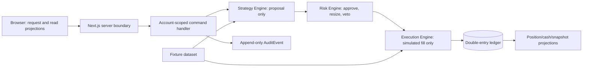

# Architecture

Milestone 1 financial behavior is locked in [Financial Policies](FINANCIAL_POLICIES.md). Architectural modules must consume those versioned policies rather than duplicate constants or rounding logic.

## 1. Decision: account-scoped modular monolith

The MVP is a Next.js App Router/TypeScript modular monolith with PostgreSQL and proposed Supabase Auth/Postgres. A `FinancialAccount` is the ownership and monetary consistency boundary, not a global singleton or a user ID sprinkled across unrelated tables. This permits multiple users and multiple accounts without adding organisations or teams.



The authoritative path is strictly `Strategy → Risk → Execution → Ledger`. Strategy code is pure and proposes intent; it cannot import repositories that mutate money. Risk may veto/resize and is persisted before execution. Execution accepts only a validated risk-approved order and posts its trade settlement and journal atomically. Projections, analytics, and dashboards are rebuildable consumers, never authorities.

M5 evidence authority follows the same server-only, append-only principle. A `CONFIGURED` manifest-authority revision selects the exact raw evidence IDs/fingerprints, compatibility configuration, and dataset-pin triples for one canonical context and `asOf`. The producer consumes that record verbatim and never searches for or heuristically selects “best” evidence. Authority records are immutable and versioned; deterministic IDs/fingerprints make same-record replay idempotent while conflicting material content fails closed. Creating these configured records remains a separate provisioning/operations responsibility until an explicitly authorized source exists; external evidence population and scheduling are not part of this slice.

## 2. Server and browser boundary

The browser may authenticate, request an account-scoped command with an idempotency key, and display server-provided projections. It must never receive privileged database credentials, use a service role, calculate an authoritative balance/risk result, write a ledger entry, mark an order filled, select an execution price, or create an audit result.

M5 `CONFIGURED` authority records are provisioned by a server-only application service from a strict, version-controlled JSON document. The companion CLI is dry-run by default; `--apply` is accepted only after a complete assembly has proven every explicit manifest reference against visible raw evidence and exact dataset-pin triples. Provisioning never chooses “best” evidence and never invokes canonical M5 production. No production configuration exists yet because the deployed raw M5 tables are empty; external raw-data population remains the next blocker.

External M5 evidence must bind a revision-specific, append-only asset mapping. The mapping key includes provider, dataset/version, provider namespace and provider asset ID; ticker/symbol alone is never authoritative. Raw evidence carries `mappingRevisionId` in its domain fingerprint and PostgreSQL row, and the resolver returns `NOT_FOUND` or `AMBIGUOUS` instead of selecting a newest or “best” mapping. No external provider client is selected or implemented yet; provider/legal approval and trustworthy `availableAt` semantics remain separate blockers.

M5 ingestion provenance is provider-neutral and server-only. A logical request is
bound to a mandatory idempotency key, then to explicit execution attempts and
contiguous immutable lifecycle events. Provider material is represented by an
immutable source artifact; parser output is a separate versioned source envelope,
so parser upgrades never overwrite prior normalized output. Attempts append
source observations, and a `RETRIEVAL_OBSERVED` availability claim pins the exact
observation timestamp used for downstream temporal visibility. No ingestion path
selects a “best” record, retains full provider payloads by default, or creates
mapping revisions, raw M5 evidence, authority records, or canonical M5 output.
Slice 1 is pure domain/application code with strict fixture parsing from a trusted
request/attempt context; temporal quality is derived by policy rather than accepted
from fixture input, and in-memory
repositories; PostgreSQL persistence and normalized downstream lineage belong to
Slice 2. M3 privilege hardening is mandatory before any real provider-data import.

Slice 2A adds seven server-only, append-only PostgreSQL provenance tables and
explicit asynchronous persistence ports. A PostgreSQL unit of work locks an
attempt parent while validating and appending lifecycle events; provider network
calls, file reads and parsing remain outside the transaction. Slice 2B will add
normalized downstream lineage to mapping and raw M5 evidence separately. M3
privilege hardening remains a required step before real provider import.

M3 registry and evidence tables are server-only: RLS remains defense-in-depth,
and `anon`/`authenticated` have no direct table privileges. This hardening does
not authorize real provider import; provider approval, legal review, typed
provider identity, and the remaining M5 temporal/derivation contracts remain
required before production data is introduced.

Slice 2B.1 adds source-material lineage authority only. A lineage parent seals
one normalized, sorted, non-empty availability-claim list; duplicate claim IDs
are rejected rather than silently deduplicated. Immutable member rows
are a database-readable projection and never a second authority. The aggregate
contains no candidate, purpose, mapping revision, or canonical identity. It
accepts COMPLETED and PARTIAL ingestion attempts, while future mapping and raw
evidence writers apply their own stricter policies. Mapping revisions remain the
canonical-identity authority, and downstream sourceLineageId bindings are
deliberately deferred to later slices.

Server-only code authorizes the authenticated owner, validates input schemas/scales, resolves the account aggregate, enforces idempotency and state transitions, pins dataset/strategy/risk versions, evaluates risk, writes the ledger/audit data in one database transaction, and emits rebuildable projection work. Node.js is the default runtime for financial commands and jobs. Server Components serve account-scoped reads; small Client Components handle visual interaction only. Server actions are suitable for same-origin forms, while versioned route handlers are reserved for command APIs/integrations. Neither replaces authorization or transactional validation.

## 3. Database and authorization model

Supabase Auth is proposed only for identity. `app_user.auth_user_id` maps to `auth.users`; FinancialAccount ownership is explicit. Operational financial tables should live in a non-exposed/private schema. If a user-facing projection is exposed through the Supabase Data API, enable RLS and combine `TO authenticated` with an ownership predicate rooted at `auth.uid()` through FinancialAccount; `TO authenticated` alone is not authorization. Never authorize from user-editable metadata. Service-role credentials stay server-only, and security-definer database code is avoided unless separately reviewed, non-exposed, and explicitly permissioned.

Use least privilege, short-lived secure/httpOnly sessions, CSRF protection for command paths, rate limits, schema validation, parameterized queries, audit logging for sensitive access, secret rotation, encrypted backups, and deletion/export workflows. Administrative fixture-data curation has a separate role and audit trail. Financial command authorization must be performed server-side even if RLS also protects tables.

## 4. Temporal data, market data, and backtest integrity

M1 has no external API: it uses `mm-fixture-market-data/v1`, a small committed/test fixture dataset with immutable source metadata and availability timestamps. A future import adapter creates immutable `MarketDataset` versions and `MarketPrice` records instead of overwriting history. Price queries declare asset, dataset, field, adjustment policy, and `decision_at`; they may only return data with `available_at <= decision_at`.

Backtests reuse the production decision pipeline and freeze engine release, strategy version/configuration, risk version, point-in-time asset-universe membership (including delisted/inactive assets), benchmark, dataset/checksum, calendar, price availability policy, fee/spread/slippage/fill model, corporate-action policy, starting cash, currency, dates, and random seed. They process chronologically. They must not use future prices, today’s constituents for historical universes, undated corrections, or a close price unavailable at the simulated decision time. Missing prices fail closed for trading and flag incomplete valuation; they never default to zero or forward-fill without a declared policy. Benchmarks are calculated from a separately identified, similarly time-available series. If point-in-time universe data is unavailable, the run must prominently report survivorship-bias risk and cannot claim to be survivorship controlled.

M1 does not need a general historical-data platform, but its fixture replay tests must demonstrate use of only an already-available reference price, immediate deterministic fill after risk approval, costs, spread/slippage/fee input application, missing-price rejection, and repeatability. Dataset and strategy/risk versions must be part of a run fingerprint. Randomness is prohibited in M1; any later stochastic component requires a persisted seed and algorithm version.

## 5. Ledger, projections, jobs, and API boundaries

The multi-commodity double-entry ledger is authoritative. `FinancialCommand`, `LedgerTransaction`, `LedgerEntry`, audit event, and terminal settlement are created in one serializable/appropriately locked database transaction. Cash, positions, cost basis, portfolio snapshots, analytics, and dashboard views are projections with reconciliation checks. No background worker has an alternate financial mutation path: jobs invoke the same account-scoped command service or only rebuild projections.

Commands are explicit and idempotent: `createVirtualDeposit`, `changePortfolioConfiguration`, `evaluateStrategy`, `createRiskApprovedOrder`, `executeSimulatedFill`, and `reverseLedgerTransaction`. M1 orders are MARKET only and full-or-no-fill; execution uses the versioned deterministic mid/spread/slippage/fee policy. Reads expose projections, decisions, and explanations. A command includes account/portfolio ID, expected aggregate version where relevant, idempotency key, and canonical payload. APIs return recorded outcomes and IDs, not predictions or investment advice.

PostgreSQL jobs are sufficient for snapshot/projection/backtest work. Do not introduce a queue, Python service, microservice, live market adapter, or paper-execution adapter in M1. A future adapter interface may exist at the module boundary, but vendor SDKs must not leak into strategy, risk, ledger, or portfolio modules.

## 6. Testing and observability

Unit tests cover value objects/rounding, per-commodity ledger balance, cost-basis lots, command idempotency, state transitions, strategy purity, risk vetoes, price availability, and fee/slippage arithmetic. Property tests prove balance, non-negative cash, cap compliance, no duplicate outcomes, and deterministic replay. Golden fixtures pin a complete deposit-to-fill-to-snapshot journal sequence, including a reversal and rejected order.

Integration tests prove database constraints, account ownership/RLS isolation, transaction rollback, concurrent/retried commands, immutable versions, and projection reconciliation. E2E tests cover disclosure, virtual deposit, risk rejection, accepted simulated fill, audit explanation, and dashboard read. Tests must use fixture/synthetic data and no production identity or external market data.

Structured logs/traces carry correlation, command, account, order, ledger-transaction, dataset, and job IDs but not secrets. Alert on ledger imbalance, audit write failure, duplicate settlement attempt, stale/missing price, reconciliation drift, failed job, or unauthorized command. Audit data and observability telemetry remain separate.

## 7. Environments and proposed structure

Use isolated local, staging, and production environments with distinct identity/database projects, secrets, fixtures, and feature flags. No production credentials or market data in local/staging fixtures. Database migrations, backup/restore testing, RLS tests, and monitoring are prerequisites when infrastructure is explicitly approved.

```text
app/                         # routes/layouts; no financial calculations
src/
  domain/                    # immutable value objects and pure engines
    money/ quantity/ ledger/ strategy/ risk/ execution/ portfolio/
  application/               # account-scoped commands and queries
  infrastructure/            # DB repositories, auth, jobs, adapters
  ui/                         # presentation only
tests/
  unit/ property/ integration/ e2e/ fixtures/
docs/
```

## 8. M5 source-lineage-backed mapping

`SourceLineage` is immutable source-material authority. New
`AssetMappingRevision` records carry a mandatory `sourceLineageId`; the
mapping revision ID remains the logical provider-asset identity, while a
lineage change under that identity is a fingerprint conflict. Source record
IDs, payload fingerprint, observed time, and available time are derived from
the validated lineage. Mapping creation accepts only COMPLETED ingestion
attempts and is transaction-scoped. Provider namespace and asset identity are
reviewed mapping inputs until a typed provider identity contract exists.
Raw M5 evidence now binds to the same mapping-derived `sourceLineageId`.
Raw provenance is derived as `M5_SOURCE_LINEAGE`, the lineage artifact-ID
projection, the lineage fingerprint, and the lineage observed/available
timestamps. Raw creation is COMPLETED-only under the current mapping
contract; provisional PARTIAL evidence requires a future staging contract.
The extended database foreign key proves mapping revision, source lineage,
provider/dataset scope, and canonical identity together. Assembly continues
to select exact manifest evidence IDs and never selects a lineage.
Provider import and real-data population remain unimplemented.

## 9. M5 provider asset identity authority

`ProviderAssetIdentityAssertion` is immutable parser/provider-side identity
authority. Version 1 supports only a typed EVM contract address: a canonical
`eip155:<chainId>` namespace plus a lower-case 20-byte address. Ticker, symbol,
name, and free text are not identities. An assertion never claims canonical
identity; `AssetMappingRevision` remains the sole provider-to-canonical mapping
authority. A mapping requires both an assertion and sealed, COMPLETED
`SourceLineage`; the assertion's exact artifact/envelope pair must be a member
of that lineage. Assertion, lineage, and mapping are validated in one server
transaction. Provider adapters/APIs, legal approval, and real data import stay
out of scope. History-span, volatility, and suspicious clean/no-findings remain
blockers for M5 production authority.

## 10. M5 crypto history and volatility derivations

The deterministic daily-close derivations are pure domain material, not raw
evidence and not provider authority. They consume an immutable normalized
series of observation IDs, canonical UTC timestamps, positive fixed-point
close values, one price scale, and one quote unit. `crypto-daily/v1` sorts by
`observedAt` and then `observationId`, rejects duplicate timestamps or IDs,
requires at least 15 observations and 14 returns, and allows a maximum elapsed
gap of exactly 48 hours. Coverage is elapsed UTC time; crypto has no trading-
day calendar.

`history-span/crypto-daily/v1` computes
`floor((latestObservedAt - earliestObservedAt) / 86_400_000)` in the existing
day unit. `volatility/crypto-daily/v1` computes arithmetic basis-point returns
with mathematical floor rounding and population standard deviation. Both use
integer-only `bigint` arithmetic, deterministic integer square root, scale 0,
and no annualization. The evaluator still owns all eligibility thresholds.

READY material is fingerprinted from the complete normalized series,
availability timestamps, policy/derivation/rounding versions, as-of, units,
scale, and ordered observation IDs. INCOMPLETE and INVALID results carry only
bounded stable diagnostics. The material remains non-authoritative until a
future adapter binds it to a validated provider assertion, sealed source
lineage, mapping revision, and persisted raw evidence. Provider adapters,
legal approval, real-data import, and suspicious-evidence semantics remain
separate scope.

## 11. M5 suspicious assessment authority and manifest binding

An empty suspicious-evidence list is not evidence of a clean assessment. The
immutable `M5SuspiciousAssessment` authority explicitly represents either
`NO_FINDINGS` or `FINDINGS_PRESENT`; the latter owns an exact, fingerprinted
membership set of existing suspicious finding rows. `NO_FINDINGS` is valid only
when the trusted server-side rule-set authority proves exact rule coverage and
the source/mapping lifecycle is sealed and `COMPLETED`.

Assessment IDs bind the logical scope, rule-set and detector versions, mapping,
lineage, and `asOf`. Assessment fingerprints additionally bind the result,
covered rules, exact finding IDs/fingerprints, timestamps, source material and
dataset pins. `recordedAt` is excluded. Assessments and membership rows are
append-only, immutable, transaction-scoped, and never repaired or selected by
newest-wins logic.

The authoritative manifest is `m5-evidence-manifest/v2` and contains one exact
`suspiciousAssessment` reference (ID plus fingerprint); it cannot contain a
legacy suspicious list. Producer reads that exact assessment and its sealed
finding membership, and assembly validates scope, rule coverage, timestamps,
pins, and exact membership before returning `COMPLETE`. Missing assessment is
`INCOMPLETE`; corrupt or contradictory authority is invalid. The evaluator is
called only for `COMPLETE` assemblies. `NO_FINDINGS` maps to CLEAN and
`FINDINGS_PRESENT` maps to SUSPICIOUS; neither mapping can be inferred from an
empty list. Canonical M5 stores the assessment ID, fingerprint, and result in
its immutable material fingerprint. Manifest-v1 and the legacy empty-list flow
fail closed and must not be used for production or deployment.

## 12. Manual provider-neutral ingestion-to-lineage boundary

`m5-normalized-source-package/v1` is a strict, secret-safe manual input contract, not a raw provider payload or provider adapter. Its parser rejects unknown fields, secret-like keys, query-bearing URLs, unsafe cursors, non-canonical UTC timestamps, duplicate records/ordinals, and quarantined temporal material. File I/O and pure deterministic planning happen before any database connection. Planning derives every provenance ID/fingerprint and the only successful lifecycle: `STARTED`, one `SOURCE_OBSERVED` per observation, then `COMPLETED`.

`npm run m5:ingest -- --package <path>` is dry-run by default; `--apply` requires server-only `DATABASE_URL`. Apply uses one PostgreSQL transaction and one shared `TransactionSql` for request, attempt, events, artifacts, envelopes, observations, availability claims, and COMPLETED-only sealed source-lineage membership. The package is synthetic/manual input and proves neither provider data nor legal/identity authority. Provider contracts, legal and availability decisions, identity assertions, mapping, raw evidence, manifests, canonical M5, scheduling, and notifications remain separate work.

## 13. M5 typed provider adapter boundary

The development-only Ethereum mainnet adapter contract is provider-neutral at
the boundary and currently has deterministic CoinGecko and Etherscan V2
fixture parsers. Request plans, raw fixture input, strict parsed records, and
the projection into `m5-normalized-source-package/v1` are separate stages;
fixture replay never performs network I/O or opens a database transaction.

`m5-provider-availability-policy/v1` treats receipt time as the earliest
provable availability unless a documented provider publication timestamp is
available. Paginated material uses the maximum receipt timestamp, derived
availability is the maximum of all material inputs, and `asOf` must be at
least that value. Runtime timestamps are injected at the network boundary;
recording time is persistence metadata and is not material fingerprint data.

Provider output is strict, fixed-point and secret-safe: unknown or
secret-like fields are rejected, decimal values become bigint plus explicit
scale, and no raw payload is retained. CoinGecko pool ranking is not total
liquidity authority and null market cap is never replaced by FDV. Etherscan
verification is `VERIFIED`, explicitly `UNVERIFIED`, or `UNKNOWN`; empty or
ambiguous responses do not become negative findings.

This slice does not authorize concentration/holder denominators, complete
suspicious-rule coverage, canonical identity or M5 persistence. Commercial
storage and redistribution remain blocked pending legal approval. Provider
network work must complete before any future database transaction; these
fixtures only prove deterministic parser and projection behavior.

## 14. M5 holder concentration authority foundation

`m5-holder-snapshot/v1` is a provider-neutral, immutable authority material
for a complete Ethereum mainnet holder snapshot. A snapshot is READY only when
all pages and holders are present, page ordinals are contiguous with an
explicit final page, the declared holder count and TOTAL_SUPPLY denominator
reconcile exactly, and every page is bound to the same block, token decimals,
source records and payload fingerprints. A top-holder endpoint without a
complete pagination proof is therefore INCOMPLETE, never a concentration value.

The first policy is deliberately conservative: `TOTAL_SUPPLY` and
`INCLUDE_ALL` only. No burn, treasury, bridge, pool, exchange or contract
address is heuristically excluded. Explicit-exclusion material is unsupported
until a separate immutable classification authority exists. Concentration is
derived with integer-only arithmetic and mathematical ceiling rounding to BPS
(scale 0): the largest holder for `SINGLE_CONCENTRATION`, and the ten largest
(or all holders when fewer than ten exist) for `TOP10_CONCENTRATION`.

Block number/hash, finality (versioned minimum depth), canonical EVM addresses,
UTC timestamps, and source IDs are part of the deterministic snapshot identity
and fingerprint. Runtime/recording time is excluded. Concentration materials
also bind their explicit `asOf` and have their own fingerprint. The pure result is only normalized
authority material; it is not raw eligibility evidence, mapping or lineage
authority, a suspicious assessment, an evaluator result, canonical M5 input,
or persistence input. Provider/legal completeness and future persistence may
also require a NUMERIC-capable storage contract when token atom values exceed
PostgreSQL `bigint`; the domain accepts canonical uint256-range atom strings so
that persistence does not silently narrow this authority material.

## 15. M5 holder snapshot adapter boundary

`m5-holder-snapshot-adapter/v1` is a fixture-only, provider-neutral boundary
for turning a strict synthetic page set into two pure projections: the existing
`m5-normalized-source-package/v1` (one auditable source record per page) and
the existing `m5-holder-snapshot/v1` domain material. It proves neither that a
real provider can enumerate every holder nor that a top-holder endpoint is a
complete universe. Missing pages, contradictory block/supply material and
insufficient finality remain incomplete or invalid and never produce partial
concentration values.

## 16. M5 holder snapshot authority persistence

The holder persistence boundary accepts only a validated adapter page set that
has already passed through manual ingestion and a sealed, `COMPLETED`
`SourceLineage`. The snapshot parent, normalized page membership, holder
membership, and the two BPS derivations are written in one transaction-scoped
unit of work. The service locks and rereads lineage authorities before writing,
requires exact artifact/envelope/observation/claim equality, and returns the
authoritative reread. `PARTIAL`, `FAILED`, `CANCELLED`, open, missing, corrupt,
or mismatched lineage material cannot write.

The persistence schema is append-only and server-only: RLS is enabled, client
roles have no privileges, there are no policies or `SECURITY DEFINER` paths,
and the existing immutable mutation trigger rejects updates and deletes.
Holder atom values use `NUMERIC(78,0)` with explicit uint256 bounds so no
JavaScript number conversion can lose precision. This slice creates no raw
eligibility evidence or canonical M5 record, and the migration remains
unapplied to hosted environments until a separate deployment decision.

Page fingerprints, source IDs, receipt timestamps and the explicit finality
reference are reconstructed and validated. Effective availability is the
maximum receipt time across all material pages and finality evidence; it is not
backdated to the first page or block timestamp. Parsing, assembly and both
projections are deterministic, immutable and database-free, and can be fed to
the manual-ingestion dry-run without opening a UoW. Network I/O must remain
outside any later persistence transaction. Provider completeness, legal
retention, commercial redistribution and production readiness remain explicit
external blockers.

The adapter separates payload identity from receipt identity: page payload
fingerprints bind response content and exclude page/finality receipt times,
while normalized-package observations use the maximum material receipt and
retain both page and finality receipt timestamps in the envelope/auditable
fields. Thus a replay of unchanged content has the same payload identity but a
later snapshot availability/fingerprint, and the finality proof survives the
package-to-provenance boundary.
### M5 holder concentration evidence binding

Holder concentration raw evidence is created only from the persisted, sealed holder snapshot and its exact `SINGLE_CONCENTRATION`/`TOP10_CONCENTRATION` derivation pair. A single transaction validates the mapping, provider identity assertion, COMPLETED SourceLineage and snapshot authority before inserting both quantitative rows. Concentration rows carry snapshot, derivation and `asOf` authority fields; all other quantitative metrics retain the prior nullable shape. The binding is server-only, append-only and replay-idempotent, with no provider/network, manifest, evaluator or canonical operation.

### M5 daily series authority persistence

`m5-daily-series-authority/v1` binds a normalized daily-close series to one
sealed, `COMPLETED` SourceLineage. Every observation retains its artifact,
envelope, observation, provider record and payload fingerprint, while the
parent records the exact ordered material set and maximum receipt availability.
The existing `history-span/crypto-daily/v1` and
`volatility/crypto-daily/v1` derivations are reused without reimplementing
their bigint mathematics; exactly one row for each derivation is sealed with
the parent and observations in one transaction. The server-only schema uses
`NUMERIC(78,0)` for close atoms, RLS with no client policies or privileges, and
the immutable mutation trigger. Replay is idempotent and material conflicts,
missing members, lifecycle failures and timestamp/cadence violations fail
closed. This fixture/provider-neutral slice performs no provider calls and
creates no raw evidence, manifest or canonical M5; its migration remains
unapplied to hosted environments until separately approved.
