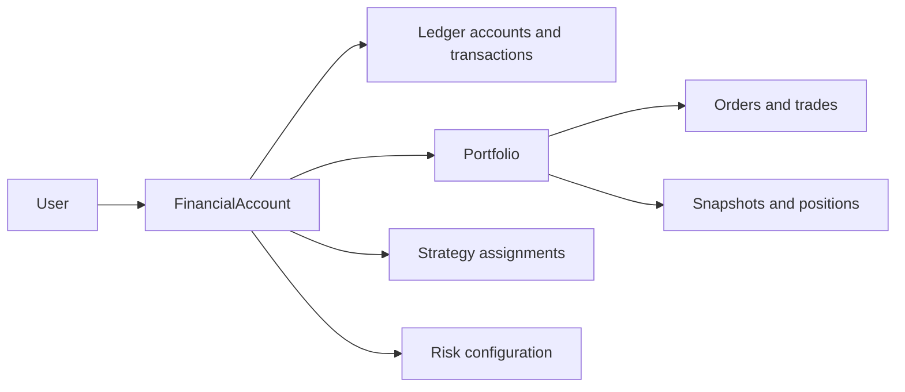

# Financial Domain Model

The exact Milestone 1 monetary rules, scales, constants, policy identifiers, rounding, and mandatory tests are canonical in [Financial Policies](FINANCIAL_POLICIES.md). This document defines the domain boundaries that implement those locked policies.

## 1. Aggregate, ownership, and authority

`FinancialAccount` is the owned financial aggregate. A `User` may own zero or more FinancialAccounts; every portfolio, ledger account, strategy assignment, risk configuration, order, trade, snapshot, and financial command belongs to exactly one FinancialAccount (directly or through its portfolio). This supports multiple users and multiple accounts per user without adding organisations, teams, or shared ownership in the MVP.



`FinancialAccount` is the transaction/concurrency boundary for monetary commands. A server command authorizes the owner, uses an account-scoped idempotency key, locks the necessary account/order records, writes its ledger transaction and audit event atomically, then updates rebuildable projections. The browser never writes the ledger, positions, orders, or risk outcomes directly.

The initial default base currency is NOK, stored as `base_currency_code` on FinancialAccount. The engine must use that field and a currency metadata registry, never a hard-coded `NOK` branch. USD and EUR can be introduced later by creating accounts with those base currencies. No FX conversion, cross-currency positions, or consolidated multi-currency NAV is part of the MVP; assets whose quote currency differs from the account base currency are ineligible.

## 2. Exact-value types, precision, and rounding

Authoritative persisted values are integer atomic values, transported through TypeScript as `bigint` internally and decimal strings at API/JSON boundaries. PostgreSQL may use `numeric(38,0)` to persist those integers; it must not store fractional authoritative amounts. JavaScript `number`, IEEE-754 floats, chart values, and display-format values are non-authoritative only.

| Value object | Representation | Example |
| --- | --- | --- |
| `Money` | `currency_code` + `minor_units` integer; scale comes from ISO 4217 metadata | `1250.50 NOK` = `NOK, 125050` |
| `AssetQuantity` | `asset_id` + `atomic_units` integer; scale is immutable `asset.quantity_scale` | `0.4278` shares at scale 4 = `4278`; `0.013725 BTC` at scale 6 = `13725` |
| `Price` | quote currency + integer `price_atoms` + explicit `price_scale` (minor units per whole asset unit) | avoids a floating price field |
| `Ratio`/weight | signed fixed-scale integer with declared scale | `12.50%` is an integer at a documented ratio scale |

For a quantity `q / 10^quantityScale` and price `p / 10^priceScale` quote-currency minor units per whole asset, notional minor units are `round(q × p / 10^(quantityScale + priceScale))`. The operation must name its purpose and rounding mode. The exact M1 `FLOOR`/`CEILING` rules, input-rejection boundary, and persisted calculation evidence are locked in `m1-rounding/v1`. Never silently change an asset quantity scale, a currency exponent, or a price scale after records exist. Overflow, negative values where prohibited, division by zero, invalid scale, and excessive precision fail closed.

## 3. Double-entry, multi-commodity ledger

The ledger is the authoritative financial source of truth. It is a proper double-entry, multi-commodity ledger because cash and asset units are different commodities. `LedgerTransaction` is an immutable journal with two or more `LedgerEntry` records. An entry has a positive integer atomic amount, `DEBIT` or `CREDIT`, a `LedgerAccount`, and that account’s one declared commodity. Within each LedgerTransaction, the signed sum is zero **for each commodity**, not merely in aggregate.

`LedgerAccount` is scoped to one FinancialAccount and declares its account class (`ASSET`, `LIABILITY`, `EQUITY`, `INCOME`, `EXPENSE`, `CLEARING`), normal side, commodity (`MONEY:<currency>` or `ASSET:<asset-id>`), and optional portfolio/asset dimension. `LedgerTransaction` records the business type, occurred/effective time, command ID, reversal-of transaction ID when applicable, and immutable narrative. `LedgerEntry` records transaction ID, ledger-account ID, debit/credit, atomic amount, commodity, and source reference. A database-level deferred balancing constraint/trigger and application pre-check enforce balance.

The ledger carries virtual cash, contributed virtual capital, asset quantity, asset cost basis in base-money, fees, realised P&L, and clearing accounts. Positions and available cash are projections derived from ledger entries plus settled trade/lots; they are reconciled regularly back to the journal. Market valuation is deliberately a snapshot/projection, not a ledger posting: unrealised P&L changes only when a declared valuation price is applied, preserving cost basis and avoiding accidental historical restatement.

### Illustrative journal patterns

All examples are simulated and simplified. Debit and credit totals balance per commodity; a trade uses both money and asset-unit legs.

| Business event | Debit | Credit |
| --- | --- | --- |
| Virtual deposit, 1250.50 NOK | `Cash:NOK` 125050 | `VirtualContributedCapital:NOK` 125050 |
| Buy 0.4278 asset units for 535.00 NOK | `AssetQuantity:<asset>` 4278 units; `AssetCostBasis:<asset>:NOK` 53500 | `AssetClearing:<asset>` 4278 units; `Cash:NOK` 53500 |
| Sell units with 535.00 NOK cost basis for 600.00 NOK | `AssetClearing:<asset>` units sold; `Cash:NOK` 60000 | `AssetQuantity:<asset>` units sold; `AssetCostBasis:<asset>:NOK` 53500; `RealisedGain:NOK` 6500 |
| Fee of 5.00 NOK | `FeeExpense:NOK` 500 | `Cash:NOK` 500 |
| Realised loss of 65.00 NOK | `Cash:NOK` sale proceeds; `RealisedLoss:NOK` 6500 | `AssetCostBasis:<asset>:NOK` cost basis; balance quantity leg via clearing |
| Virtual withdrawal, 100.00 NOK | `VirtualCapitalWithdrawals:NOK` 10000 | `Cash:NOK` 10000 |
| Correction/reversal | exact opposite entries, linked by `reversal_of_transaction_id` | original transaction remains immutable |

Cost-basis lots/allocations identify the historical cost removed on each sale. A correction never edits a posted transaction, fill, or deposit: it adds a balanced compensating transaction with a reason and audit link. Ledger accounts use a normal balance convention; reports must calculate signed balances from direction rather than relying on a signed stored amount.

## 4. Entity and table boundaries

These are proposed tables, not infrastructure. UUIDs, UTC timestamps, actor/source, and FinancialAccount ownership are mandatory where applicable.

| Table/entity | Essential fields and rules |
| --- | --- |
| `app_user` | `auth_user_id`, disclosure acceptance; maps to identity only, not credentials. |
| `financial_account` | `user_id`, `base_currency_code`, `mode` (`SIMULATION`, later `PAPER`), status; no mixed modes. |
| `portfolio` | `financial_account_id`, risk-profile version, status, projection version. |
| `financial_command` | account, command type, idempotency key, request hash, outcome/status, correlation ID; unique `(financial_account_id, idempotency_key)`. |
| `ledger_account` | account, class, normal side, commodity, optional portfolio/asset dimension, status. |
| `ledger_transaction` | account, business type, effective/recorded timestamp, command ID, reversal link, narrative; immutable after posting. |
| `ledger_entry` | transaction, ledger account, debit/credit, atomic amount, commodity; balance rule per transaction/commodity. |
| `capital_deposit` / `capital_withdrawal` | account, command, money, requested/effective time, linked posted ledger transaction; virtual-only M1 deposit, withdrawal schema reserved. |
| `asset` | stable instrument identity, symbol/MIC, quote currency, immutable quantity scale/increment, lifecycle, asset-registry version. |
| `market_dataset` | provider/version, `as_of_cutoff`, checksum, licence scope, ingestion state; immutable once complete. |
| `market_price` | asset, dataset, price atoms/scale, `market_observed_at`, `available_at`, `ingested_at`, field/adjustment/source; unavailable prices are ineligible. |
| `strategy` / `strategy_version` | immutable published version, deterministic parameters, engine release, universe and data eligibility rules. |
| `strategy_assignment` | account/portfolio, strategy version, enabled state, allocation cap; scoped through FinancialAccount. |
| `strategy_signal` / `strategy_proposal` | strategy/version, frozen input hash, decision time, proposed intent; not an order or ledger event. |
| `risk_profile` / `risk_rule` | immutable published configuration; priority, conditions, action, scale/rounding, version. |
| `risk_assessment` / `risk_rule_result` | proposal/order candidate, final disposition, every evaluated rule and evidence. |
| `order` | account/portfolio, proposal/assessment, requested and approved amounts/quantity, M1 MARKET lifecycle state, idempotency/command link. |
| `trade` / `trade_fill` | order, actual quantity/reference-final price/fee, execution-policy versions, linked ledger transaction; immutable fill facts. |
| `cost_basis_lot` / `lot_allocation` | purchase basis and quantities; deterministic lot-selection version for sale calculation. |
| `position_projection` / `portfolio_snapshot` | rebuildable ledger/trade projections; snapshot has data set and valuation completeness. |
| `backtest` / `backtest_run` | frozen definition and immutable run/fingerprint, versions, seed, event stream, warnings/results. |
| `performance_metric` | derived metric, calculation version/window/benchmark/run-or-snapshot reference. |
| `audit_event` (DecisionLog) | append-only who/what/why/input/output/version/data/ledger evidence with correlation and optional hash chain. |
| `job` | idempotent durable work for snapshots/backtests; no financial authority outside a command transaction. |

## 5. Idempotent command protocol

Every monetary or state-changing command—deposit, withdrawal, portfolio configuration mutation, order creation, simulated execution, settlement, reversal—includes a caller-supplied opaque idempotency key. In one database transaction the authoritative server:

1. authorizes ownership and validates a canonical request;
2. inserts/locks `financial_command` under the account-wide unique key;
3. compares a request hash on replay: same key + same hash returns the original result; same key + different hash returns an idempotency conflict;
4. locks the FinancialAccount and involved order/ledger rows, validates state and risk approval;
5. creates exactly one linked ledger transaction, audit event, and projection/outbox work; and
6. commits once.

Unique links prevent duplicated consequences even if a worker retries: one posted deposit transaction per deposit, one settlement ledger transaction per fill, and one terminal execution outcome per order. Failed commands do not consume a key until their durable result is known; transient failures may be safely retried with the same key. Idempotency records and response bodies are retained for the documented retry window, while ledger uniqueness remains permanent.

## 6. Order and trade state machines

An M1 order records MARKET-order intent; it is not a financial event. M1 deliberately has no partial fills or asynchronous external settlement. Its states are `CREATED`, `VALIDATED`, `RISK_APPROVED`, `FILLED`, `REJECTED`, and `CANCELLED`. Allowed forward transitions are:

```text
CREATED -> VALIDATED -> RISK_APPROVED -> FILLED
CREATED | VALIDATED -> REJECTED
CREATED -> CANCELLED
```

Rejection, cancellation, and `FILLED` are terminal. An error is corrected with a separate reversal, never a state rewrite. Execution alone creates one complete TradeFill from a `RISK_APPROVED` order and settles its one journal atomically. A rejected/cancelled order cannot produce a trade or ledger transaction.

## 7. Temporal model and backtest clock

Every fact carries the timestamp relevant to its meaning: `occurred_at` (business event), `recorded_at` (server persistence), `market_observed_at` (market/vendor timestamp), `available_at` (first time the system could legitimately use it), `ingested_at` (system arrival), `decision_at`, `execution_at`, `settled_at`, and `snapshot_as_of`. These fields are not interchangeable.

Backtests select inputs only where `available_at <= decision_at`. M1’s fixture convention is explicit: the latest eligible fixture price is the decision reference mid price and the same record produces the immediate deterministic simulated MARKET fill after risk approval. This is permissible only because its `available_at` precedes/equal the decision; a later record can never influence the decision or fill. Versioned datasets preserve the availability timeline. Missing/stale prices prohibit trading; a valuation snapshot is marked incomplete rather than inventing a price. Corporate-action treatment (adjusted prices versus explicit actions) is pinned per dataset and never mixed within a run.

## 8. Decision and audit evidence

`audit_event` is the implementation name for the user-facing DecisionLog. It captures: event type/outcome; actor and command/idempotency/correlation IDs; FinancialAccount and portfolio; reason and user-visible explanation; strategy ID/version and proposal; risk profile/version, every rule result and final disposition; market dataset/price IDs and all temporal cutoffs; execution/fill policy; order/trade IDs; ledger transaction/entry IDs; input/output hashes; engine release; previous audit hash; and before/after projection references. It is append-only and application roles cannot update/delete it.

## 9. Domain invariants

The complete canonical M1 invariant and test list is maintained in [Financial Policies](FINANCIAL_POLICIES.md#8-canonical-m1-financial-invariants). The following domain-level list must remain consistent with it.

- Every posted LedgerTransaction has at least two entries and debits equal credits for every commodity.
- Ledger entries, transactions, fills, and audit evidence are immutable; corrections/reversals are linked compensating records.
- Authoritative Money never uses JavaScript `number`; authoritative quantity, price, ratios, and rates never depend on binary floating point.
- Currency exponent, asset quantity scale, and price scale are validated and cannot silently change historical interpretation.
- Every financial record is scoped to one FinancialAccount whose owner is authorized for the command/read.
- An order cannot reach `RISK_APPROVED` without validation and a recorded passing RiskAssessment.
- Execution accepts only a currently risk-approved order; a rejected/cancelled order cannot fill or create a ledger transaction.
- A trade fill has one and only one settlement transaction; a settlement balances and is idempotent.
- A portfolio cannot spend ledger-derived available cash, borrow, create a negative asset quantity, or violate a hard post-trade cap.
- Strategy output is proposal-only; it has no repository or ledger mutation path.
- Risk rules are evaluated deterministically in their published priority order and have veto precedence.
- Reuse of an idempotency key with equal input returns the original outcome; different input is rejected and cannot duplicate a side effect.
- A backtest/paper decision never uses market data unavailable at its decision time.
- FIFO lot consumption, explicit fees, and execution assumptions are versioned and reproducible from retained fills and journals.
- Snapshots and metrics identify their source dataset, cutoff, asset/strategy/risk/execution/fee versions, and are reproducible from retained inputs.
- Positions, cash, lots, and snapshots reconcile against ledger/trade state; drift fails visibly.
- Every monetary mutation has corresponding immutable audit evidence.
- Only an authorized server transaction may change authoritative financial state; browser values are untrusted requests.
